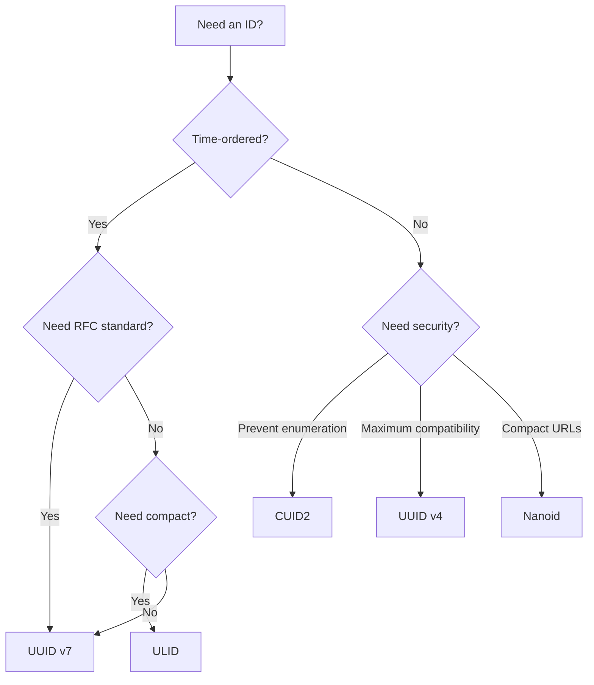

Not sure which ID format to use? This guide will help you choose the right one based on your requirements.

## Quick Decision Matrix

<CardGroup cols={2}>
  <Card title="Database Primary Keys" icon="database">
    **Recommended:** UUID v7 or ULID
    
    Time-ordered IDs improve database index performance and query efficiency.
  </Card>
  
  <Card title="URL Shorteners" icon="link">
    **Recommended:** Nanoid
    
    Compact, URL-safe characters keep URLs short and readable.
  </Card>
  
  <Card title="Prevent Enumeration" icon="shield">
    **Recommended:** CUID2
    
    Non-sequential IDs prevent attackers from guessing valid IDs.
  </Card>
  
  <Card title="Maximum Compatibility" icon="check">
    **Recommended:** UUID v4
    
    Universal standard supported by virtually all databases and systems.
  </Card>
  
  <Card title="Distributed Systems" icon="server">
    **Recommended:** ULID
    
    Sortable with high entropy, perfect for distributed generation.
  </Card>
  
  <Card title="Session Tokens" icon="key">
    **Recommended:** Nanoid or CUID2
    
    Short, secure, and random for session management.
  </Card>
</CardGroup>

## Detailed Comparison

### Time-Ordered vs Random

**Time-ordered IDs** (UUID v7, ULID, KSUID) embed a timestamp and sort naturally by creation time:

```typescript
import { uuidv7 } from 'uniku/uuid/v7'

const [first, second, third] = [uuidv7(), uuidv7(), uuidv7()]
console.log(first < second && second < third) // true
```

<Info>
**Benefits of time-ordering:**
- Improved database index performance
- Natural chronological sorting
- Can extract creation timestamp
- Better locality in B-tree indexes
</Info>

**Random IDs** (UUID v4, CUID2, Nanoid) provide no time information:

```typescript
import { uuidv4 } from 'uniku/uuid/v4'

const ids = [uuidv4(), uuidv4(), uuidv4()]
// IDs are random - no predictable ordering
```

<Warning>
Time-ordered IDs can leak information about creation time and volume. If this is a security concern, use CUID2 or UUID v4 instead.
</Warning>

### Characteristics Comparison

| Format | Time-Ordered | Length | Encoding | Entropy | Binary Size |
|--------|--------------|--------|----------|---------|-------------|
| **UUID v4** | ❌ | 36 chars | Hex (with dashes) | 122 bits | 16 bytes |
| **UUID v7** | ✅ | 36 chars | Hex (with dashes) | 74 bits* | 16 bytes |
| **ULID** | ✅ | 26 chars | Crockford Base32 | 80 bits* | 16 bytes |
| **CUID2** | ❌ | 24 chars** | Base36 | High | No binary format |
| **Nanoid** | ❌ | 21 chars** | URL-safe Base64 | 126 bits | No binary format |
| **KSUID** | ✅ | 27 chars | Base62 | 128 bits* | 20 bytes |

<Note>
\* Time-ordered IDs allocate bits to timestamp, reducing random entropy. The entropy listed is for the random portion only.

\*\* CUID2 and Nanoid support custom lengths.
</Note>

## Use Case Recommendations

### Database Primary Keys

**Use UUID v7 or ULID** for optimal performance:

```typescript
import { uuidv7 } from 'uniku/uuid/v7'

// In your database model
interface User {
  id: string // UUID v7
  email: string
  createdAt: Date
}

const user = {
  id: uuidv7(),
  email: 'user@example.com',
  createdAt: new Date()
}
```

<Tip>
**Why time-ordered?** Most databases use B-tree indexes. Time-ordered IDs insert at the end of the index, avoiding expensive page splits and fragmentation.
</Tip>

**UUID v7** is ideal when:
- You need RFC-standard compliance
- Your database has native UUID type support
- You want to extract timestamps: `uuidv7.timestamp(id)`

**ULID** is ideal when:
- You want shorter string representation (26 vs 36 characters)
- You prefer case-insensitive encoding
- You're using it in URLs or file names

### URL Shorteners and Public IDs

**Use Nanoid** for compact, URL-friendly identifiers:

```typescript
import { nanoid } from 'uniku/nanoid'

// Short URL
const shortUrl = `https://example.com/${nanoid(8)}`
// => https://example.com/V1StGXR8

// Invite code
const inviteCode = nanoid(12)
// => IRFa-VaY2bQj
```

**Benefits:**
- Compact (21 characters by default)
- URL-safe (no encoding needed)
- Customizable length and alphabet
- Fast generation

### Preventing Enumeration Attacks

**Use CUID2** when you need to prevent ID guessing:

```typescript
import { cuid2 } from 'uniku/cuid2'

// API keys or tokens
const apiKey = cuid2()
// => pfh0haxfpzowht3oi213cqos

// Invoice numbers (not sequential)
const invoiceId = cuid2({ length: 16 })
// => tz4a98xxat4eqr3z
```

<Warning>
**Avoid time-ordered IDs** if:
- You don't want to leak creation time
- You want to prevent volume estimation
- You need to hide sequential patterns
</Warning>

### Distributed Systems

**Use ULID or UUID v7** for collision-free distributed generation:

```typescript
import { ulid } from 'uniku/ulid'

// Each microservice can generate IDs independently
const orderId = ulid()
const paymentId = ulid()

// IDs sort correctly even when generated on different servers
```

**Why they work well:**
- No coordination needed between nodes
- Timestamp prefix ensures global ordering
- High entropy prevents collisions
- Can merge and sort logs from multiple sources

### Maximum Compatibility

**Use UUID v4** when compatibility is paramount:

```typescript
import { uuidv4 } from 'uniku/uuid/v4'

const id = uuidv4()
// => 550e8400-e29b-41d4-a716-446655440000
```

**Best for:**
- Legacy systems requiring RFC 4122 compliance
- Databases with native UUID type (Postgres, MySQL)
- When time-ordering isn't needed
- Maximum interoperability

## Performance Considerations

Generation speed varies significantly:

| Generator | Performance |
|-----------|-------------|
| ULID | **85× faster** than npm ulid |
| CUID2 | **8× faster** than @paralleldrive/cuid2 |
| KSUID | **1.5× faster** than @owpz/ksuid |
| UUID v7 | **1.1× faster** than uuid@v7 |
| Nanoid | **~comparable** to nanoid |
| UUID v4 | npm uuid is 1.1× faster |

See the [Performance Guide](/guides/performance) for detailed benchmarks.

## Migration Paths

Switching from another ID library? Check the [Migration Guide](/guides/migration) for:

- Drop-in replacement instructions
- API differences to be aware of
- Breaking changes
- Compatibility notes

## Decision Flowchart



## Summary

<Accordion title="Quick Reference Table">

| Scenario | Best Choice | Second Choice |
|----------|-------------|---------------|
| Database primary keys | UUID v7 | ULID |
| URLs and short codes | Nanoid | CUID2 |
| Security tokens | CUID2 | Nanoid |
| Legacy compatibility | UUID v4 | UUID v7 |
| Distributed systems | ULID | UUID v7 |
| File names | ULID | Nanoid |
| Session IDs | Nanoid | CUID2 |
| Invoice numbers | CUID2 | UUID v4 |

</Accordion>

<Note>
Still unsure? Start with **UUID v7** for database IDs and **Nanoid** for user-facing identifiers. Both are excellent general-purpose choices.
</Note>
